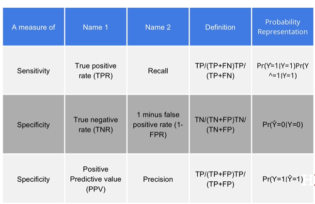
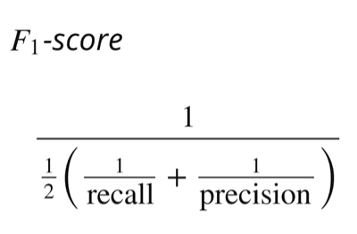
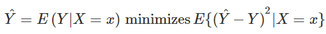

# Caret package, training and test sets, and overall accuracy

## Description
This is the first example for creating a ML model in *R*

## Notes
1. Add dependencies
```{r}
library(tidyverse)
library(caret)
library(dslabs)
library(e1071)
data(heights)
```

2. Define outputs **Y** & features **X**
```{r}
y <- heights$sex
x <- heights$height
```

We can create training $ test data sets with *caret*
3. Define sets
```{r}
set.seed(2007)
testIndex <- createDataPartition(y, 1, p = 0.5, list = FALSE)
trainSet <- heights[-testIndex, ]
testSet <- heights[testIndex, ]
```

# First ML algorithm
We'll **guess** the output, from the testSet
```{r}
yHat <- sample(c("Male", "Female"), length(testIndex), replace = TRUE)
```
Like this, we don't have Factors, which is recommended
```{r}
yHat <- sample(c("Male", "Female"), length(testIndex), replace = TRUE) %>% factor(levels = levels(testSet$sex))
```

Check the **mean** from the testSet
```{r}
mean(yHat == testSet$sex)
```
But, males are higher than females. So...
```{r}
heights %>% group_by(sex) %>% summarize(mean(height), sd(height))
```
## Predict male if height is within two std dv.
```{r}
yHat <- ifelse(x > 62, "Male", "Female") %>% factor(levels = levels(testSet$sex))
```
Check the **mean** from the testSet
```{r}
mean(yHat == testSet$sex)
```
## Examine the accuracy we obtain with 10 different cutoffs
This is better than guessing, though!
```{r}
cutoff <- seq(61, 70)
accuracy <- map_dbl(cutoff, function(x) {
  yHat <- ifelse(trainSet$height > x, "Male", "Female") %>% factor(levels = levels(testSet$sex))
  mean(yHat == trainSet$sex)
})
```
Result from the cutoffs
```{r}
plot(cutoff, accuracy, type = "o")
bestCutoff <- cutoff[which.max(accuracy)]
```

## Check cutoff on the test data
```{r}
yHat <- ifelse(testSet$height > bestCutoff, "Male", "Female") %>% factor(levels = levels(testSet$sex))
yHat <- factor(yHat)
mean(yHat == testSet$sex)
```

# Confusion matrix
Tabulates each combination of prediction and actual value
```{r}
table(predicted = yHat, actual = testSet$sex)
```

```{r}
testSet %>% 
  mutate(yHat = yHat) %>% 
  group_by(sex) %>% 
  summarize(accuracy = mean(yHat == sex))
prev <- mean(y == "Male")
```

**Sensitivity**: Ability of an algorithm to predict a positive outcome when the actual outcome is positive. For FP

**Specificity**: Ability of an algorithm to not predict the positive. For TP



```{r}
confusionMatrix(data = yHat, reference = testSet$sex)
```
# Balanced accuracy and F1 score
**Balanced accuracy**: One number summary for specificity and sensitivity


**Beta**: Represent how much more important sensitivity is compared to specificity 


## Updating F|M height code
```{r}
cutoff <- seq(61, 70)
F_1 <- map_dbl(cutoff, function(x){
  yHat <- ifelse(trainSet$height > x, "Male", "Female") %>% 
    factor(levels = levels(testSet$sex))
  F_meas(data = yHat, reference = factor(trainSet$sex)) # New!
})
max(F_1)

bestCutoff <- cutoff[which.max(F_1)]
yHat <- ifelse(testSet$height > bestCutoff, "Male", "Female") %>% 
  factor(levels = levels(testSet$sex))
sensitivity(data = yHat, reference = testSet$sex) # New!
specificity(data = yHat, reference = testSet$sex) # New!
plot(cutoff, F_1, type = "o")
```

# The ROC curve
For each parameter, we can get a different sensitivity and specificity. So, it's necessary to compare both.

**Precision recall plot**: Give us the prevalance measure

```{r}
p <- 0.9
n <- length(testIndex)
yHat <- sample(c("Male", "Female"), n, replace = TRUE, prob=c(p, 1-p)) %>% 
  factor(levels = levels(testSet$sex))
mean(yHat == testSet$sex)
```
Getting ROC curve
```{r}
# ROC curve
probs <- seq(0, 1, length.out = 10)
guessing <- map_df(probs, function(p){
  yHat <- 
    sample(c("Male", "Female"), n, replace = TRUE, prob=c(p, 1-p)) %>% 
    factor(levels = c("Female", "Male"))
  list(method = "Guessing",
       FPR = 1 - specificity(yHat, testSet$sex),
       TPR = sensitivity(yHat, testSet$sex))
})
guessing %>% qplot(FPR, TPR, data =., xlab = "1 - Specificity", ylab = "Sensitivity")

cutoffs <- c(50, seq(60, 75), 80)
height_cutoff <- map_df(cutoffs, function(x){
  yHat <- ifelse(testSet$height > x, "Male", "Female") %>% 
    factor(levels = c("Female", "Male"))
   list(method = "Height cutoff",
        FPR = 1-specificity(yHat, testSet$sex),
        TPR = sensitivity(yHat, testSet$sex))
})
```
Plot both curves together
```{r}
# plot both curves together
bind_rows(guessing, height_cutoff) %>%
  ggplot(aes(FPR, TPR, color = method)) +
  geom_line() +
  geom_point() +
  xlab("1 - Specificity") +
  ylab("Sensitivity")

library(ggrepel)
map_df(cutoffs, function(x){
  yHat <- ifelse(testSet$height > x, "Male", "Female") %>% 
    factor(levels = c("Female", "Male"))
   list(method = "Height cutoff",
        cutoff = x, 
        FPR = 1-specificity(yHat, testSet$sex),
        TPR = sensitivity(yHat, testSet$sex))
}) %>%
  ggplot(aes(FPR, TPR, label = cutoff)) +
  geom_line() +
  geom_point() +
  geom_text_repel(nudge_x = 0.01, nudge_y = -0.01)
```
Plot precision vs recal
```{r}
# plot precision against recall
guessing <- map_df(probs, function(p){
  yHat <- sample(c("Male", "Female"), length(testIndex), 
                  replace = TRUE, prob=c(p, 1-p)) %>% 
    factor(levels = c("Female", "Male"))
  list(method = "Guess",
    recall = sensitivity(yHat, testSet$sex),
    precision = precision(yHat, testSet$sex))
})

height_cutoff <- map_df(cutoffs, function(x){
  yHat <- ifelse(testSet$height > x, "Male", "Female") %>% 
    factor(levels = c("Female", "Male"))
  list(method = "Height cutoff",
       recall = sensitivity(yHat, testSet$sex),
    precision = precision(yHat, testSet$sex))
})

bind_rows(guessing, height_cutoff) %>%
  ggplot(aes(recall, precision, color = method)) +
  geom_line() +
  geom_point()
guessing <- map_df(probs, function(p){
  yHat <- sample(c("Male", "Female"), length(testIndex), replace = TRUE, 
                  prob=c(p, 1-p)) %>% 
    factor(levels = c("Male", "Female"))
  list(method = "Guess",
    recall = sensitivity(yHat, relevel(testSet$sex, "Male", "Female")),
    precision = precision(yHat, relevel(testSet$sex, "Male", "Female")))
})

height_cutoff <- map_df(cutoffs, function(x){
  yHat <- ifelse(testSet$height > x, "Male", "Female") %>% 
    factor(levels = c("Male", "Female"))
  list(method = "Height cutoff",
       recall = sensitivity(yHat, relevel(testSet$sex, "Male", "Female")),
    precision = precision(yHat, relevel(testSet$sex, "Male", "Female")))
})
bind_rows(guessing, height_cutoff) %>%
  ggplot(aes(recall, precision, color = method)) +
  geom_line() +
  geom_point()
```

# Conditional probabilities
- Bayes' Rule
- Good estimate of **p(x)** will suffice to build optimal predictors
- P(Y = y | X = x)
**Expectation**: Probability of randomly picking a value since the avg is a proportion of it

**THE Best** in general is by defining a **Loss function**
- Squared loss function: (YHat -Y)^2
  - As close to 0 as possible



