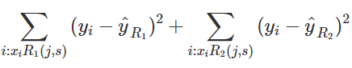
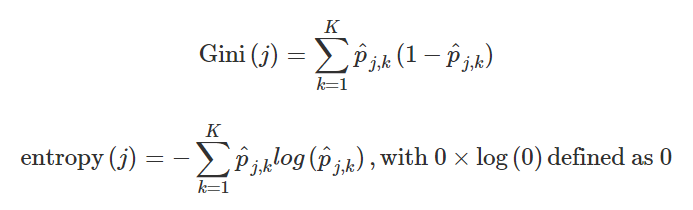

# Classification with More than Two Classes and the Caret Package

## Trees motivation

- LDA and QDA are **not meant to be used with many predictors *p*** because the number of parameters needed to be estimated becomes too large.

- **Curse of dimensionality**: For kernel methods such as kNN or local regression, when they have multiple predictors used,  the span/neighborhood/window made to include a given percentage of the data become large. With larger neighborhoods, our methods lose flexibility. The dimension here refers to the fact that when we have  *p* predictors, the distance between two observations is computed in *p* -dimensional space.

## Classification and Regression Trees (CART)

Init data
```{r}
library(tidyverse)
library(dslabs)
data("olive")
olive %>% as_tibble()
table(olive$region)
olive <- select(olive, -area)
```


- A tree is basically a **flow chart of yes or no questions.** The general idea of the methods we are describing is to define an algorithm that uses data to create these trees with predictions at the ends, referred to as nodes.

  - When the outcome is continuous, we call the decision tree method a regression tree.

    - **Partitioning the predictors**: to build a decision tree and, at end of each node, obtain a predictor  y^ . Mathematically, we are partitioning the predictor space into  J  non-overlapping regions,  R1  ,  R2 , ...,  RJ  and then for any predictor  x  that falls within region  Rj , estimate  f(x)  with the average of the training observations  yi  for which the associated predictor  xi  in also in  Rj .

  - How to pick the best J?
  
    - By using the minimum of **RSS** (Residual sum squares)
      

  - Two common parameters used for partition decision are the complexity parameter (cp) and the minimum number of observations required in a partition before partitioning it further
  
  - If we already have a tree and want to apply a higher cp value, we can use the prune() function. We call this pruning a tree because we are snipping off partitions that do not meet a cp criterion.
  
Predict using KNN
```{r}
library(caret)
fit <- train(region ~ .,  method = "knn", 
             tuneGrid = data.frame(k = seq(1, 15, 2)), 
             data = olive)
ggplot(fit)
```

Plot distribution of each predictor by region
```{r}
olive %>% gather(fatty_acid, percentage, -region) %>%
  ggplot(aes(region, percentage, fill = region)) +
  geom_boxplot() +
  facet_wrap(~fatty_acid, scales = "free") +
  theme(axis.text.x = element_blank())
```

Now for two tipoes of elements
```{r}
p <- olive %>% 
  ggplot(aes(eicosenoic, linoleic, color = region)) + 
  geom_point()
p + geom_vline(xintercept = 0.065, lty = 2) + 
  geom_segment(x = -0.2, y = 10.54, xend = 0.065, yend = 10.54, color = "black", lty = 2)
```

Now, look for the poll data
```{r}
data("polls_2008")
qplot(day, margin, data = polls_2008)

library(rpart)
fit <- rpart(margin ~ ., data = polls_2008)
```

A first split
```{r}
plot(fit, margin = 0.1)
text(fit, cex = 0.75)
polls_2008 %>% 
  mutate(y_hat = predict(fit)) %>% 
  ggplot() +
  geom_point(aes(day, margin)) +
  geom_step(aes(day, y_hat), col="red")
```

Let's change the parameters, cp = 0 gives us the original data
```{r}
fit <- rpart(margin ~ ., data = polls_2008, control = rpart.control(cp = 0, minsplit = 2))
polls_2008 %>% 
  mutate(y_hat = predict(fit)) %>% 
  ggplot() +
  geom_point(aes(day, margin)) +
  geom_step(aes(day, y_hat), col="red")
```

Now, we use cross validation
```{r}
library(caret)
train_rpart <- train(margin ~ ., method = "rpart", tuneGrid = data.frame(cp = seq(0, 0.05, len = 25)), data = polls_2008)
ggplot(train_rpart)
```

The final model
```{r}
plot(train_rpart$finalModel, margin = 0.1)
text(train_rpart$finalModel, cex = 0.75)
polls_2008 %>% 
  mutate(y_hat = predict(train_rpart)) %>% 
  ggplot() +
  geom_point(aes(day, margin)) +
  geom_step(aes(day, y_hat), col="red")
```

Prune the tree 
```{r}
pruned_fit <- prune(fit, cp = 0.01)
```

## Classification (Decision) Trees
We use them when the output is categorical

- **Decision trees** form predictions by calculating which class is the most common among the training set observations within the partition, rather than taking the average in each partition

Some useful tools are *Gini index* & *entropy*



**Pros*: Classification trees are highly interpretable and easy to visualize.They can model human decision processes and don’t require use of dummy predictors for categorical variables.

**Cons**: The approach via recursive partitioning can easily over-train and is therefore a bit harder to train than. Furthermore, in terms of accuracy, it is rarely the best performing method since it is not very flexible and is highly unstable to changes in training data.

```{r}
# fit a classification tree and plot it
train_rpart <- train(y ~ .,
              method = "rpart",
              tuneGrid = data.frame(cp = seq(0.0, 0.1, len = 25)),
              data = mnist_27$train)
plot(train_rpart)

# compute accuracy
confusionMatrix(predict(train_rpart, mnist_27$test), mnist_27$test$y)$overall["Accuracy"]
```

## Random Forests
- Average of multiple decision tress

- A very popular machine learning approach that addresses the shortcomings of decision trees. The goal is to improve prediction performance and reduce instability by averaging multiple decision trees (a forest of trees constructed with randomness)

  - To generate many predictors, each using regression or classification trees, and then forming a final prediction based on the average prediction of all these trees. To assure that the individual trees are not the same, we use the bootstrap to induce randomness.

- A disadvantage of random forests is that we lose interpretability

- An approach that helps with interpretability is to examine variable importance. To define variable importance we count how often a predictor is used in the individual trees. The caret package includes the function varImp that extracts variable importance from any model in which the calculation is implemented

```{r}
library(randomForest)
fit <- randomForest(margin~., data = polls_2008) 
plot(fit)

polls_2008 %>%
  mutate(y_hat = predict(fit, newdata = polls_2008)) %>% 
  ggplot() +
  geom_point(aes(day, margin)) +
  geom_line(aes(day, y_hat), col="red")

library(randomForest)
train_rf <- randomForest(y ~ ., data=mnist_27$train)
confusionMatrix(predict(train_rf, mnist_27$test), mnist_27$test$y)$overall["Accuracy"]

# use cross validation to choose parameter
train_rf_2 <- train(y ~ .,
      method = "Rborist",
      tuneGrid = data.frame(predFixed = 2, minNode = c(3, 50)),
      data = mnist_27$train)
confusionMatrix(predict(train_rf_2, mnist_27$test), mnist_27$test$y)$overall["Accuracy"]
```

## Caret Package
```{r}
library(tidyverse)
library(dslabs)
data("mnist_27")

library(caret)
```

Two different ways to implement different training models
```{r}
train_glm <- train(y ~ ., method = "glm", data = mnist_27$train)
train_knn <- train(y ~ ., method = "knn", data = mnist_27$train)

y_hat_glm <- predict(train_glm, mnist_27$test, type = "raw")
y_hat_knn <- predict(train_knn, mnist_27$test, type = "raw")

confusionMatrix(y_hat_glm, mnist_27$test$y)$overall[["Accuracy"]]
confusionMatrix(y_hat_knn, mnist_27$test$y)$overall[["Accuracy"]]
```

## Tuning Parameters with Caret
```{r}
getModelInfo("knn")
modelLookup("knn")

train_knn <- train(y ~ ., method = "knn", data = mnist_27$train)
ggplot(train_knn, highlight = TRUE)

train_knn <- train(y ~ ., method = "knn", 
                   data = mnist_27$train,
                   tuneGrid = data.frame(k = seq(9, 71, 2)))
ggplot(train_knn, highlight = TRUE)
train_knn$bestTune
train_knn$finalModel
confusionMatrix(predict(train_knn, mnist_27$test, type = "raw"),
                mnist_27$test$y)$overall["Accuracy"]

control <- trainControl(method = "cv", number = 10, p = .9)
train_knn_cv <- train(y ~ ., method = "knn", 
                      data = mnist_27$train,
                      tuneGrid = data.frame(k = seq(9, 71, 2)),
                      trControl = control)
ggplot(train_knn_cv, highlight = TRUE)
```
Basic results
```{r}
train_knn$results %>% 
     ggplot(aes(x = k, y = Accuracy)) +
     geom_line() +
     geom_point() +
     geom_errorbar(aes(x = k, 
                       ymin = Accuracy - AccuracySD,
                       ymax = Accuracy + AccuracySD))
```

The conditional probabilities
```{r}
plot_cond_prob <- function(p_hat=NULL){
     tmp <- mnist_27$true_p
     if(!is.null(p_hat)){
          tmp <- mutate(tmp, p=p_hat)
     }
     tmp %>% ggplot(aes(x_1, x_2, z=p, fill=p)) +
     geom_raster(show.legend = FALSE) +
          scale_fill_gradientn(colors=c("#F8766D","white","#00BFC4")) +
          stat_contour(breaks=c(0.5),color="black")
}

plot_cond_prob(predict(train_knn, mnist_27$true_p, type = "prob")[,2])
```

Installing new packages
```{r}
install.packages("gam")
modelLookup("gamLoess")
```

Tuning parameters
```{r}
grid <- expand.grid(span = seq(0.15, 0.65, len = 10), degree = 1)

train_loess <- train(y ~ ., 
               method = "gamLoess",
               tuneGrid=grid,
               data = mnist_27$train)
ggplot(train_loess, highlight = TRUE)

confusionMatrix(data = predict(train_loess, mnist_27$test), 
                reference = mnist_27$test$y)$overall["Accuracy"]

p1 <- plot_cond_prob(predict(train_loess, mnist_27$true_p, type = "prob")[,2])
p1
```


