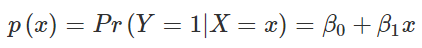
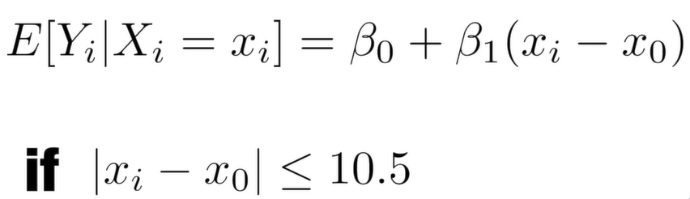

# Linear Regression for Prediction, Smoothing, and Working with Matrices Overview

## Linear regressionm
```{r}
library(tidyverse)
library(caret)
library(dslabs)
library(e1071)
library(HistData)
set.seed(2019)
galtonHeights <- GaltonFamilies %>%
  filter(gender == "male") %>%
  group_by(family) %>%
  sample_n(1) %>%
  ungroup() %>%
  select(father, childHeight) %>%
  rename(son = childHeight)
```

Train & Test sets
```{r}
y <- galtonHeights$son
testIndex <- createDataPartition(y, times = 1, p = 0.5, list = FALSE)

trainSet <- galtonHeights %>% slice(-testIndex)
testSet <- galtonHeights %>% slice(testIndex)
```

Guessing son's height
```{r}
avg <- mean(trainSet$son)
```
So, *R squared loss*
```{r}
mean((avg - testSet$son) ^ 2)
```

**Least squares - The Linear regression model**
```{r}
fit <- lm(son ~ father, data = trainSet)
fit$coef
```
So, *R squared loss*
```{r}
yHat <- fit$coef[1] + fit$coef[2] * testSet$father
mean((yHat - testSet$son) ^ 2)
```

## Predict function
Create linear regression

```{r}
yHat <- predict(fit, testSet)
mean((yHat - testSet$son) ^ 2)
```
This is the same as the last point

Each predict function may change.
Check for help
```{r eval=FALSE, include=FALSE}
?predict.lm
?predict.glm
```

## Regression for a Categorical Outcome


Get train & test data sets
```{r}
library(dslabs)
data("heights")
y <- heights$height

set.seed(2)

test_index <- createDataPartition(y, times = 1, p = 0.5, list = FALSE)
train_set <- heights %>% slice(-test_index)
test_set <- heights %>% slice(test_index)

train_set %>% 
  filter(round(height)==66) %>%
  summarize(y_hat = mean(sex=="Female"))
```

Create a cutoff for different heights
```{r}
heights %>% 
  mutate(x = round(height)) %>%
  group_by(x) %>%
  filter(n() >= 10) %>%
  summarize(prop = mean(sex == "Female")) %>%
  ggplot(aes(x, prop)) +
  geom_point()
lm_fit <- mutate(train_set, y = as.numeric(sex == "Female")) %>% lm(y ~ height, data = .)
p_hat <- predict(lm_fit, test_set)
y_hat <- ifelse(p_hat > 0.5, "Female", "Male") %>% factor()
confusionMatrix(y_hat, test_set$sex)$overall["Accuracy"]
```

## Logistic Regression
- Assures the estimate of the conditional probability is between 0 & 1
- Turns probabilities to be symmetric around 0
- **Maximum likehood estimate**
```{r}
glm_fit <- train_set %>%
  mutate(y = as.numeric(sex == "Female")) %>%
  glm(y ~ height, data = ., family = "binomial") # Family is new!
```
**GLM**: Generalized Linear Models
```{r}
p_hat_logit <- predict(glm_fit, newdata = test_set, type = "response")
```

Results:
```{r}
y_hat_logit <- ifelse(p_hat_logit > 0.5, "Female", "Male") %>% factor
confusionMatrix(y_hat_logit, test_set$sex)$overall[["Accuracy"]]
```
It fits data much better

## Case study
Look for digits, having:

- 4 blocks for the number
- 2 features: Upper left (*x_1*) & lower right (*x_2*) from the digits division
```{r}
data("mnist_27")
fit <- glm(y ~ x_1 + x_2, data = mnist_27$train, family = "binomial")
```
Get predictions with **testSet**
```{r}
pHat <- predict(fit, newdata = mnist_27$test)
yHat <- factor(ifelse(pHat > 0.5, 7, 2))
confusionMatrix(data = yHat, reference = mnist_27$test$y)
```
Plot conditional probabilities
```{r}
mnist_27$true_p %>% ggplot(aes(x_1, x_2, fill=p)) +
  geom_raster()
```
Plot conditional probabilities *with separates pairs of X1 & X2*
Conditional probability is bigger than 0.5 and lower than 0.5
```{r}
mnist_27$true_p %>% ggplot(aes(x_1, x_2, z = p, fill=p)) +
  geom_raster() +
  scale_fill_gradientn(colors = c("#F8766D", "white", "#00BFC4")) +
  stat_contour(breaks = c(0.5), color = "black")
```
Here, the logistics regression forces the estimates to be a plane and our boundary to be a line. There might be other methods to solve this conflict.

## Introduction to Smoothing
To detect trends in the presence of noisy data where the shape of the trend is unknown

Poll votes from USA
```{r}
data("polls_2008")
qplot(day, margin, data = polls_2008)
```

Estimate the conditional probability of y depending on x.
ie, *f(x) = E(Y | X = x)*.

It's no OK a straight line. There's a lack of fit

We can smooth it by getting the mean of margins by 1 day, because, if *|x - xo| < 3.5 = mu*, consider mu as a constant.

```{r}
span <- 7
fit <- with(polls_2008, 
            ksmooth(day, margin, x.points = day, kernel = "box",
                    bandwidth = span))
polls_2008 %>% mutate(smooth = fit$y) %>%
  ggplot(aes(day, margin)) +
  geom_point(size = 3, alpha = 0.5, color = "orange") +
  geom_line(aes(day, smooth), color = "red")
```
Here, **Kernel**: Function to compute weighted averages.

{
  0: Points outside the window
  1 / N0: Points inside the window
}

**N0** - # of points in that week

With this, we can use Gaussian density to assign weights.

To change the kernel, just change the **kernel** parameter from **ksmooth** function.

# Final Result
```{r}
span <- 7
fit <- with(polls_2008,
            ksmooth(day, margin, x.points = day, kernel = "normal", 
                    bandwidth = span))
polls_2008 %>% mutate(smooth = fit$y) %>%
  ggplot(aes(day, margin)) +
  geom_point(size = 3, alpha = 0.5, color = "orange") +
  geom_line(aes(day, smooth), color = "red")

```

This is smoother.
Change: **kernel = "normal"**

k-smooth fits a constant. So, it can be improved

**LOESS**: Local weighted regression

This make us consider larger windows

Now, assume function is *locally linear*



This make us use larger sample sizes to estimate our local parameters.

The size of the windows give different smoothing

Main characteristics:

- Expects a proportion, so # of points are the same.

- Uses a weighted approach by **The Tukey tri-weight**.

- Has the option of fitting the local model. **family = "symmetric"

With this, we can fit parabolas

```{r}
polls_2008 %>% ggplot(aes(day, margin)) +
     geom_point() + 
     geom_smooth()
```

**degree** changes the way of treating the points, as lines, parabolas, ...

## Matrices
```{r}
library(tidyverse)
library(dslabs)
if(!exists("mnist")) mnist <- read_mnist()

class(mnist$train$images)

x <- mnist$train$images[1:1000,] 
y <- mnist$train$labels[1:1000]
```

101 elements
```{r}
length(x[,1])
x_1 <- 1:5
x_2 <- 6:10
cbind(x_1, x_2)
dim(x)
dim(x_1)
dim(as.matrix(x_1))
dim(x)
```

Convert vector to matrix
```{r}
my_vector <- 1:15

# fill the matrix by column
mat <- matrix(my_vector, 5, 3)
mat

# fill by row
mat_t <- matrix(my_vector, 3, 5, byrow = TRUE)
mat_t
identical(t(mat), mat_t)
```

But, if there aren't enought elements, they'll repeat to satisfice the arguments
```{r}
matrix(my_vector, 5, 5)
```
Substract one image from x
```{r}
grid <- matrix(x[3,], 28, 28)
image(1:28, 1:28, grid)
```
But, it's upside-down, we need to flip it.
```{r}
# flip the image back
image(1:28, 1:28, grid[, 28:1]) # flip horizontal
```
Operations with vectors

- Rows
```{r}
sums <- rowSums(x)
avg <- rowMeans(x)
data_frame(labels = as.factor(y), row_averages = avg) %>%
    qplot(labels, row_averages, data = ., geom = "boxplot")
```
This means the quantity of ink used for each #

We can compute de same information with **apply**, which work similarly to *map* or *sapply*
```{r}
avgs <- apply(x, 1, mean)
sds <- apply(x, 2, sd)
data_frame(labels = as.factor(y), row_averages = avg) %>%
    qplot(labels, row_averages, data = ., geom = "boxplot")
```
But, they are slower.

```{r}
library(matrixStats)

sds <- colSds(x)
qplot(sds, bins = "30", color = I("black"))
image(1:28, 1:28, matrix(sds, 28, 28)[, 28:1])
```

Extract columns & rows
```{r eval=FALSE, include=FALSE}
x[ ,c(351,352)]
x[c(2,3),]
new_x <- x[ ,colSds(x) > 60]
dim(new_x)
class(x[,1])
dim(x[1,])
```
But, it's now a vector, we need to preserve it as a matrix.

Preserve the matrix class
```{r}
class(x[ , 1, drop=FALSE])
dim(x[, 1, drop=FALSE])
```
Use logical operations with matrices
```{r}
mat <- matrix(1:15, 5, 3)
mat[mat > 6 & mat < 12] <- 0
```

Binarize the data using just matrix operations
```{r}
bin_x <- x
bin_x[bin_x < 255/2] <- 0 
bin_x[bin_x > 255/2] <- 1
```

Index with matrices
```{r}
mat <- matrix(1:15, 5, 3)
as.vector(mat)
qplot(as.vector(x), bins = 30, color = I("black"))
new_x <- x
new_x[new_x < 50] <- 0
```
This means, use of ink or no-ink

Filtering matrix
```{r}
mat <- matrix(1:15, 5, 3)
mat[mat < 3] <- 0
mat

mat <- matrix(1:15, 5, 3)
mat[mat > 6 & mat < 12] <- 0
mat
```
Binarize the data
```{r}
bin_x <- x
bin_x[bin_x < 255/2] <- 0
bin_x[bin_x > 255/2] <- 1
bin_X <- (x > 255/2)*1
```

Scale each row of a matrix
```{r}
(x - rowMeans(x)) / rowSds(x)
```

Scale each column
```{r}
t(t(x) - colMeans(x))
```

Take each entry of a vector and subtracts it from the corresponding row or column
```{r}
x_mean_0 <- sweep(x, 2, colMeans(x))
```

Divide by the standard deviation
```{r}
x_mean_0 <- sweep(x, 2, colMeans(x))
x_standardized <- sweep(x_mean_0, 2, colSds(x), FUN = "/")
```